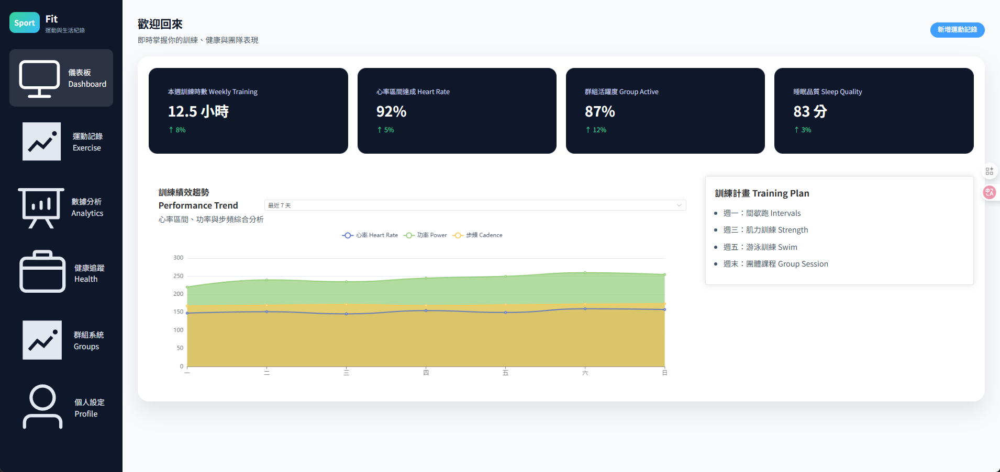

# fit_web
使用 Edge Copilot 進行網頁分析，並配合 Windsurf AI 復刻一個運動與生活紀錄的平台 DEMO 網站，包含前端(Vue 3)和後端(Node.js Express)。  

---

  

---

 

---

 

---

 

---

 

---

 

---

## backend (後端)
Node.js 22
Node.js Express
```bash
npm run dev
```

## frontend (前端)
Node.js 22
Vue 3
```bash
npm run dev
```

## 執行錯誤
- package.json
- package-lock.json
都必須要是 UTF8 格式，不然 npm run dev 會出錯。


